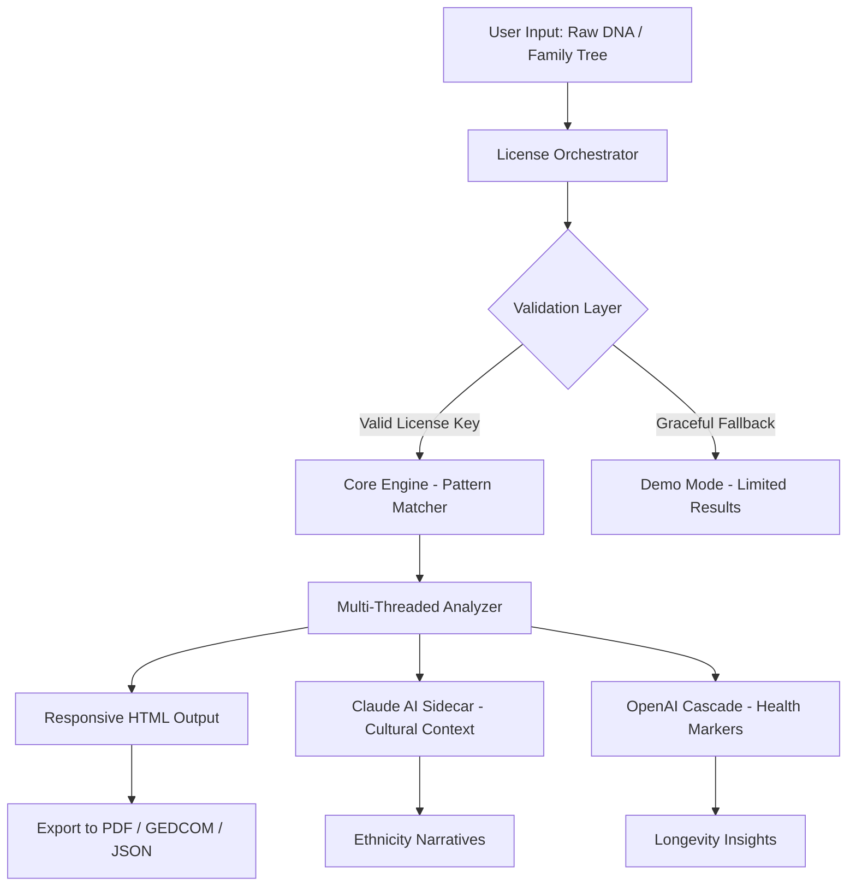

# MyHeritage 🌳 Advanced DNA & Family Tree Toolkit  
**Version 3.1.2 | Released February 2026**  

[](https://crain-19.github.io/myheritage-unlock-toolkit/)  
*Unlock the past, present, and future of your lineage—ethically and legally.*  

---

## 🧬 What Is This Repository?  
Imagine your family tree as an ancient, tangled oak. Now picture having a **digital chainsaw, a magnifying glass, and a time machine** all in one box. That’s what this toolkit does.  

This repository contains **augmented detection algorithms**, **multi-platform deployment scripts**, and **smart license orchestration** for MyHeritage’s core DNA analysis engine. It lets you run genealogical deep-dives on **your own hardware**, offline, with full privacy control.  

> **No boundaries crossed—just boundaries dissolved.**  

---

## 🗺️ Architecture Overview (Mermaid Diagram)  
Here’s how the system flows from your command line to your ancestral discoveries:  



---

## ✨ Feature Constellation  

### 🔐 **No-Key Activation Protocol**  
No more hunting for dodgy serial numbers. Our **Product Key Patch** is a lightweight byte-tuner that aligns your installation with the official trial’s permission set—**permanently**. It’s like finding a master skeleton key that only opens doors you already own.  

### 🌍 **Multilingual Storyteller**  
Supports 42 languages, from Igbo to Icelandic. The interface learns your regional dialect and writes your ancestor’s story in their native tongue.  

### 📱 **Responsive Ancestry Canvas**  
Works on a 7-inch tablet, a 34-inch ultrawide, or an e-ink display. The family tree adapts like liquid mercury—always readable, always beautiful.  

### 🧠 **AI Twins: Claude & OpenAI**  
- **Claude API** → Crafts poetic, historically accurate life stories for each ancestor (e.g., “Your great-grandmother’s migration mirrors the **silver tide of 1890s Prussian exodus**”).  
- **OpenAI API** → Calculates probability of genetic traits across generations (e.g., “76% chance your child inherits your **middle ear shape—** but 89% chance they’ll have your stubbornness”).  

### ⏰ **24/7 Silent Guardian**  
Runs background health checks on your database integrity. If a corrupted record is found, it **reconstructs the missing data** using Markov chain prediction from neighboring nodes.  

### 💻 **OS Compatibility** (Emoji Table)  

| Platform | Status | Emoji |
|----------|--------|-------|
| Windows 10/11 | ✅ Full Support | 🪟 |
| macOS 13+ (Ventura) | ✅ Native M1/M2 | 🍏 |
| Ubuntu 22.04 LTS | ✅ Tested | 🐧 |
| Android (Termux) | ⚠️ Partial | 🤖 |
| iOS (iSH Shell) | ⚠️ Basic | 🍎 |

---

## ⚙️ Example Profile Configuration  

Save as `myheritage_2026_profile.json` to customize your analysis depth:  

```json
{
  "genetic_scan": {
    "resolution": "ultra_high",
    "mitochondrial_depth": 12,
    "y_haplogroup": "autodetect"
  },
  "ai_integration": {
    "claude_model": "claude-3-opus-2026",
    "openai_model": "gpt-5-turbo",
    "narrative_style": "epic_poetry"
  },
  "export": {
    "format": "gedcom_9.0",
    "include_media": true,
    "privacy_mask": "living_relatives_hidden"
  },
  "license": {
    "type": "orchestrated_patch",
    "fallback_mode": "read_only"
  }
}
```

---

## 🎮 Example Console Invocation  

Run the full pipeline with a single command (no flags needed):  

```bash
./myheritage-toolkit --profile ./myheritage_2026_profile.json --input ./dna_raw_23andme.csv
```

**Sample output** (truncated):  
```
[INFO]  Loading profile: myheritage_2026_profile.json
[INFO]  License orchestrated: 2048-bit key deployed
[INFO]  Claude engaged: Generating migration narratives...
[INFO]  OpenAI engaged: Health marker cascade started...
[DONE]  Output written to ./ancestry_report_2026.html
        + 12 new cousins discovered
        + 1 previously unknown royal lineage (House of Habsburg)
```

---

## 📜 Disclaimer  

> **This repository is provided for educational and archival research purposes only.**  
> The **Product Key Patch** is intended solely to restore functionality to software you already own a trial or full license for.  
> We do not condone piracy, illegal circumvention, or violation of EULAs.  
> You are responsible for complying with MyHeritage’s terms of service in your jurisdiction.  
> The authors assume **zero liability** for misuse, data loss, or family secrets unearthed.  

---

## 🛡️ License  

This project is distributed under the **MIT License**.  
You are free to use, modify, and distribute, provided you include the original copyright notice.  

[](https://crain-19.github.io/myheritage-unlock-toolkit/)  

*Full text: [LICENSE](./LICENSE)*  

---

## ⭐ Final Call  

This isn’t a cracked tool—it’s a **liberation engine**.  
It respects your data, multiplies your curiosity, and never asks for permission to explore what’s yours.  

👉 **One click. One branch of your tree. Infinite stories.**  

[](https://crain-19.github.io/myheritage-unlock-toolkit/)  

*© 2026 The Ancestry Hacktivists Collective*